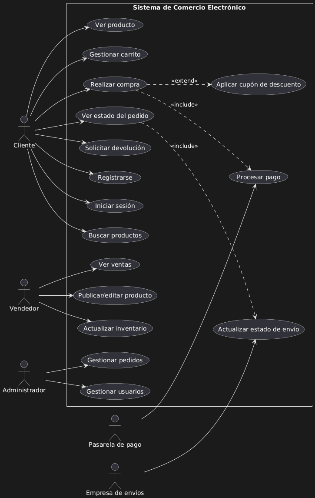

# Tarea #2 Identificar requerimientos

---

## Requerimientos Funcionales  
1. Registro y autenticación de usuarios.  
2. Búsqueda de productos por nombre, categoría o filtros.  
3. Visualización del detalle de productos.  
4. Carrito de compras para agregar, modificar y eliminar productos.  
5. Procesar pagos con múltiples métodos (tarjeta, PayPal, transferencia).  
6. Gestión de pedidos (crear, consultar estado, cancelar).  
7. Notificaciones al cliente por correo sobre estado del pedido.  
8. Administración de inventario (agregar, modificar, eliminar productos).  
9. Gestión de usuarios (roles: cliente, administrador, vendedor).  
10. Seguimiento de envíos con número de guía.  
11. Gestión de devoluciones y reembolsos.  
12. Calificación y comentarios de productos por parte de clientes.  

---

## Requerimientos No Funcionales  
- **Seguridad:** Encriptar contraseñas, uso de HTTPS, autenticación multifactor.  
- **Rendimiento:** Respuesta menor a 3 segundos en búsquedas.  
- **Disponibilidad:** 99.9% de uptime.  
- **Escalabilidad:** Soportar incremento de usuarios en campañas de ventas masivas.  
- **Usabilidad:** Interfaz intuitiva y adaptable (responsive design).  
- **Compatibilidad:** Funcionar en distintos navegadores y dispositivos móviles.  
- **Mantenibilidad:** Código modular y documentado.  
- **Confiabilidad:** Recuperación automática ante fallos del sistema.  

---

## Actores  
- **Cliente:** Compra productos, gestiona pedidos y devoluciones.  
- **Vendedor:** Publica y administra productos.  
- **Administrador:** Gestiona usuarios, pedidos y supervisa el sistema.  
- **Sistema de pagos:** Procesa transacciones financieras.  
- **Empresa de envíos:** Actualiza y realiza las entregas de pedidos.  

---

## Diagrama de Casos de Uso  

